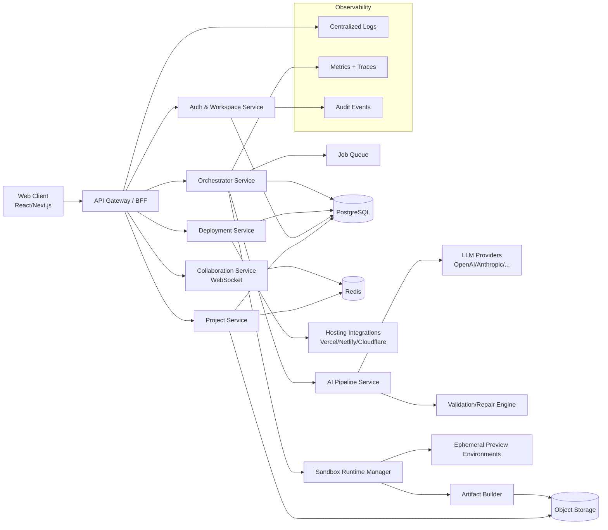

# Qwintly System Architecture

## 1) Vision and scope

Qwintly is an AI-first website builder that turns natural-language prompts into editable, deployable websites.

### In scope (MVP -> V1)

- Prompt-to-site generation
- Visual editor + AI chat copilot
- Component/code regeneration on demand
- Preview environment per project
- One-click deployment integrations
- Team workspaces, billing, and usage quotas

### Out of scope (initial phases)

- Native mobile app builder
- Full enterprise SSO matrix (SAML/SCIM can come later)
- Self-hosted on-prem distribution

---

## 2) Product capabilities mapped to architecture

1. **Auth & tenancy**
   - User accounts, workspace membership, RBAC
2. **Project orchestration**
   - Site generation jobs, version history, branching of generated snapshots
3. **AI generation pipeline**
   - Prompt enrichment, template selection, LLM completion, validation, repair loops
4. **Code execution and preview**
   - Secure sandbox runtime for build/run/preview
5. **Asset and content management**
   - Uploaded images, generated media, CMS-like content blocks
6. **Deployment management**
   - Publish to managed hosting and/or third-party providers
7. **Observability and governance**
   - Logs, traces, token usage, cost controls, moderation and policy checks

---

## 3) High-level architecture (C4: Container view)

---

## 4) Core services and responsibilities

## 4.1 Web Client (Next.js)

- AI chat interface + visual builder canvas
- Component tree inspector and property editing
- Live preview iframe connection
- Version timeline and rollback UX

## 4.2 API Gateway / Backend-for-Frontend (BFF)

- Single entry point for browser/mobile clients
- JWT/session validation, request shaping, rate-limits
- Aggregates data from internal microservices
- Handles feature flags and plan-based capability gating

## 4.3 Auth & Workspace Service

- User lifecycle: sign-up/login/password reset/oauth
- Workspace membership and role checks
- Tenant isolation policies
- Billing plan entitlement mapping

## 4.4 Project Service

- CRUD for sites, pages, components, settings
- Stores generated code snapshots and metadata
- Maintains publish history and active version pointers
- Handles import/export (zip/git)

## 4.5 Orchestrator Service

- Coordinates multi-step generation jobs
- Tracks state machine for each run (queued -> running -> validated -> applied)
- Retries failed steps with backoff
- Emits domain events (JobStarted, JobCompleted, JobFailed)

## 4.6 AI Pipeline Service

- Prompt pre-processing and context assembly
- Retrieval of reusable components/templates
- Calls LLM providers and normalizes responses
- Applies guardrails: policy checks, code linting, unsafe pattern filtering

## 4.7 Sandbox Runtime Manager

- Spins isolated execution environments (container/firecracker)
- Builds generated apps and runs preview servers
- Enforces CPU/memory/network/time limits
- Captures run logs and compile/runtime diagnostics

## 4.8 Collaboration Service

- Real-time cursor/presence for team editing
- Chat/command stream fanout
- Conflict resolution strategy (OT/CRDT-based in later stage)

## 4.9 Deployment Service

- Converts approved artifact into deploy target format
- Integrates with hosting APIs
- Rollback to previous successful deployment
- Tracks deployment status and external URLs

---

## 5) Data architecture

## 5.1 Primary data stores

- **PostgreSQL** (system of record)
  - users, workspaces, memberships, projects, pages, component_nodes, generation_jobs, deployments, billing_events
- **Redis**
  - cache, session acceleration, pub/sub, rate-limiting counters, short-lived job state
- **Object Storage (S3-compatible)**
  - generated artifacts, screenshots, media uploads, deployment bundles, logs exports

## 5.2 Multi-tenant model

- Every record includes `workspace_id`
- Row-level access enforced at service layer (and optionally DB RLS)
- Object storage keys namespaced by workspace/project

## 5.3 Suggested key entities

- `workspace(id, name, plan, created_at)`
- `project(id, workspace_id, name, framework, status, created_at)`
- `project_version(id, project_id, source_ref, created_by, created_at)`
- `generation_job(id, project_id, prompt, status, token_usage, cost_usd, created_at)`
- `deployment(id, project_id, version_id, provider, status, url, created_at)`

---

## 6) Critical flows

## 6.1 Prompt -> generated site

1. User submits prompt in Qwintly chat UI.
2. BFF forwards to Orchestrator and creates `generation_job`.
3. Orchestrator requests AI Pipeline for layout/components/content.
4. AI Pipeline calls LLM + validators/repair loops.
5. Orchestrator sends result to Sandbox for build verification.
6. On success, Project Service persists new `project_version`.
7. Web client receives update over websocket and refreshes preview.

## 6.2 Edit -> preview

1. User changes style/content/component property.
2. Patch is applied to project draft state.
3. Incremental rebuild runs in sandbox preview environment.
4. Live preview updates with near real-time latency.

## 6.3 Publish -> hosted URL

1. User clicks publish.
2. Deployment Service packages selected project version.
3. Provider adapter deploys artifact.
4. Status and final URL are saved and surfaced to client.

---

## 7) Security and compliance baseline

- OAuth + optional MFA for accounts
- Encryption in transit (TLS 1.2+) and at rest
- Secrets in vault/KMS, never in generated code artifacts
- Strict sandbox isolation for untrusted generated code
- Abuse/malicious prompt detection and content moderation
- Audit logs for admin and billing-impacting actions

---

## 8) Reliability and scalability

- Stateless services autoscaled horizontally
- Queue-based async jobs for generation and deploy workflows
- Idempotent job handlers and deployment operations
- Circuit breakers/fallback model routing for LLM providers
- SLOs (example):
  - P95 prompt-to-first-preview < 45s
  - P95 editor interaction latency < 250ms
  - Monthly availability target 99.9%

---

## 9) DevOps and environments

- **Environments**: local, staging, production
- **CI/CD**: lint, tests, security scan, build, deploy
- **IaC**: Terraform/Pulumi for cloud resources
- **Feature flags**: gradual release of model versions and UX experiments
- **Backups**:
  - PostgreSQL PITR
  - Daily object storage snapshot policy

---

## 10) Recommended initial tech stack

- **Frontend**: Next.js, TypeScript, Tailwind CSS
- **BFF/API**: Node.js (NestJS/Fastify) or Go
- **Workers/Orchestrator**: Node.js/Go + Temporal or queue workers
- **Databases**: PostgreSQL, Redis
- **Runtime isolation**: Firecracker or hardened container pools
- **Observability**: OpenTelemetry + Prometheus/Grafana + centralized logs

---

## 11) Roadmap by phase

## Phase 1: Foundation (Weeks 1-4)

- Auth/workspaces/projects
- Prompt-to-static-site generation
- Sandbox build validation
- Basic deployment to one provider

## Phase 2: Collaboration + quality (Weeks 5-8)

- Real-time collaborative editing
- Version timeline + rollback
- AI repair loop improvements
- Cost tracking and usage quotas

## Phase 3: Scale + ecosystem (Weeks 9-12)

- Multi-provider model routing
- Advanced templates/marketplace
- Team analytics and governance controls
- Production hardening and SLO reporting

---

## 12) Open design decisions

- Monorepo vs polyrepo for service boundaries
- Temporal vs custom queue orchestration
- CRDT approach choice for multiplayer edits
- Hosting strategy: managed-only vs bring-your-own-cloud
- Pricing model: token-based vs seat + usage hybrid

