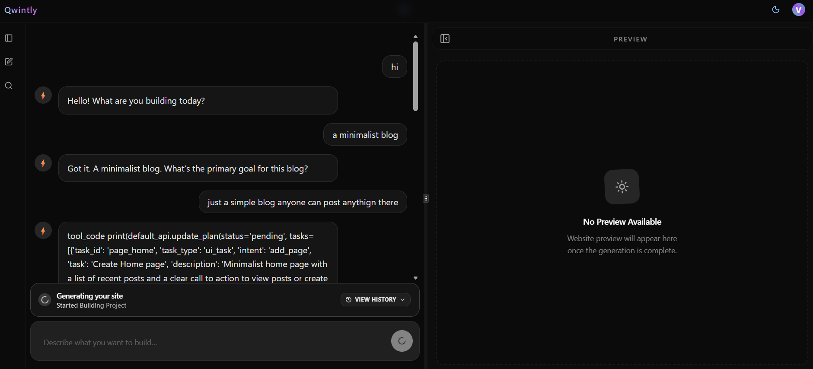
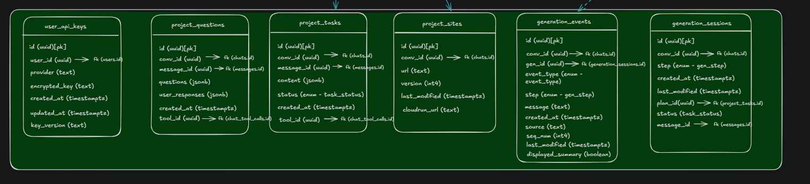
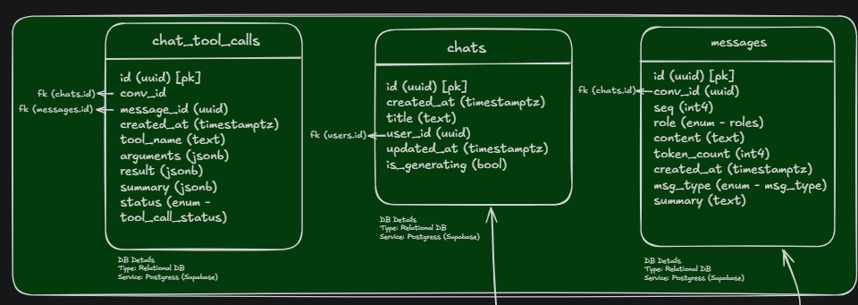
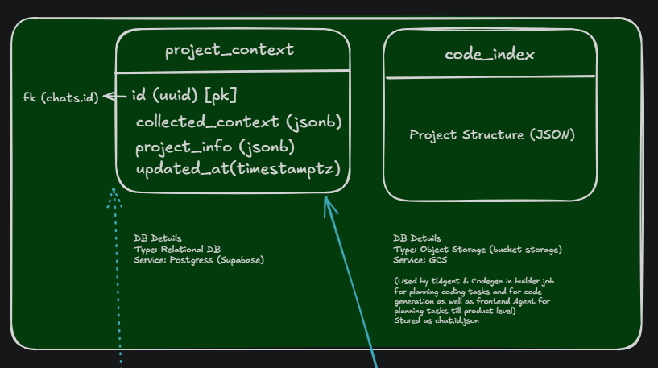

## Overview
Qwintly is a website generator like lovable or webflow. It currently generates UI only websites with no backend capabilities but planning to integrate backend stuff in near future. It is a BYOK based website generator, meaning for a generation to happen you would need to bring your own API keys. Only gemini is supported as of now with plans to integrate openai as well. 
The API Keys are safely encrypted with GCP KMS before they are stored. 
This project is more intended for non technical people who wish to generate websites with AI.

## Request flow
The user would enter his requirements using a nextJs application qwintly.com, where an AI chat agent would understand the requirements and generate a plan. The AI agent possesses capabilites of asking questions to the user using ask_questions tool.
All the user and assistant chats, question & answers and plans are persisted in database table `messages`. Along with that all the model history such as the tools called by the models and model outputs are preserved in the chat_tool_calls.
The AI chat also builds an ever expanding context based on what the user requirements. (Context is generated using a lightweight model for every user prompt. Previous context+user prompt is feeded to the lightweight model which would then update the context)

User can send max 50 messages per day (To prevent abuse)

This is the collectedContext object and what it collects

export interface CollectedContext {
  projectIdentity: ProjectIdentity;
  targetBusinessContext: TargetBusinessContext;
  branding: Branding;
  functionalRequirements: FunctionalRequirements;
  constraints: Constraints;
  otherInfo: string[];
}

export interface ProjectIdentity {
  projectName: string;
  projectType: ProjectType;
  description: string;
}

export interface TargetBusinessContext {
  targetAudience: string;
  businessModel: BusinessModel;
  industry: string;
  geography: string;
}

export interface Branding {
  tone: Tone;
  brandKeywords: string[];
  colorPreference: string[];
  designStyle: string;
}

export interface FunctionalRequirements {
  authenticationRequired: boolean;
  roles: string[];
  paymentRequired: boolean;
  integrations: string[];
  dashboardRequired: boolean;
}

export interface Constraints {
  budgetConstraints: string;
  timeline: string;
  performanceRequirements: string;
  seoRequired: boolean;
}

The plan object looks like this 

export const TASK_TYPE = {
  UI_TASK: "ui_task",
  BE_TASK: "be_task",
  DB_TASK: "db_task",
};

export type TaskType = (typeof TASK_TYPE)[keyof typeof TASK_TYPE];

export const INTENT = {
  ADD_PAGE: "add_page",
  ADD_SECTION: "add_section",
  MODIFY_SECTION: "modify_section",
  MODIFY_TEXT_CONTENT: "modify_text_content",
  MODIFY_STYLING: "modify_styling",
};

export type Intent = (typeof INTENT)[keyof typeof INTENT];

export type PlanTask = {
  task_id: string;
  task_type: TaskType;
  intent: Intent;
  task: string;
  description: string;
};

export const PLAN_STATUS = {
  PENDING: "pending",
  UPDATED: "updated",
  IMPLEMENTING: "implementing",
  IMPLEMENTED: "implemented",
};

export type PlanStatus = (typeof PLAN_STATUS)[keyof typeof PLAN_STATUS];

export type Plan = {
  id: string;
  tasks: PlanTask[];
  status: PlanStatus;
  messageId?: string;
};

The plan is more of a product level plan and not technical. 
The user will have option to approve the plan or suggest agent the modifications that can be made to the plan. 
Once user approves the plan (endpoint /generate/approve-plan), an event is published to GCP pub sub topic website-generation (push based pub sub). The request sent is signed with a secret token (JWT) so that no tempering can be done with the data. 
We have a worker that handles the push based messages. (qwintly-wg-worker) a cloud run service.
The wg-woker initiates a builder job (qwintly-builder) - a cloud run Job.
The builder based on the request type New/Update, fetches a boilerplate/previous project snapshot(zip) from GCS bucket project_snapshots and unzips it. The boilerplate is handled by the qwintly-boilerplate project. Once cloned it starts generating the technical plan, with the tech lead agent. The plan is then passed on to codegen agent which implements the plan. 
The agents are provided with project context (generated from user prompts) and code index of the project which involves the project structure and conventions. 
The agents have many capabilities with tool calls such as read_file, apply_patch (to apply code patch to the file), write_file (used for writing whole files/creating new files), delete_file, list_dir, search (grep based search for the repo), using which the user requirements are applied to the project.
The project uses a special configuration in which every route/page has a page.config.ts file which specifies the whole structure of the project and is rendered by the page.tsx
Example
import type { BuilderElement } from "@/types/elements";

export const config = {
  elements: [
    { id: "root", type: "div", className: "min-h-screen bg-gradient-to-b from-slate-950 via-slate-950 to-slate-900 text-slate-100", children: [
      { id: "wrap", type: "div", className: "mx-auto max-w-6xl px-6 py-14", children: [
        { id: "header", type: "div", className: "flex items-center justify-between gap-6", children: [
          { id: "brand", type: "div", className: "flex items-center gap-3", children: [
            { id: "brand-icon", type: "icon", className: "h-9 w-9 rounded-xl bg-slate-800/60 p-2 ring-1 ring-slate-700", props: { name: "Sparkles" } },
            { id: "brand-text", type: "text", className: "text-sm font-semibold tracking-wide text-slate-200", props: { text: "Qwintly Starter" } },
          ]},
          { id: "header-actions", type: "div", className: "flex items-center gap-2", children: [
            { id: "features-link", type: "link", className: "rounded-lg px-3 py-2 text-sm text-slate-300 transition hover:bg-slate-800/60 hover:text-slate-50", props: { href: "#features", text: "Features" } },
            { id: "github-link", type: "link", className: "inline-flex items-center gap-2 rounded-lg bg-slate-100 px-3 py-2 text-sm font-medium text-slate-950 transition hover:bg-white", props: { href: "https://github.com/", target: "_blank", rel: "noreferrer" }, children: [
              { id: "gh-icon", type: "icon", className: "h-4 w-4", props: { name: "Github" } },
              { id: "gh-text", type: "text", props: { text: "GitHub" } },
            ] },
          ]},
        ]},
        { id: "hero", type: "div", className: "mt-14 space-y-6", children: [
          { id: "badge", type: "div", className: "inline-flex items-center gap-2 rounded-full bg-slate-800/60 px-3 py-1 text-xs text-slate-200 ring-1 ring-slate-700", children: [
            { id: "badge-icon", type: "icon", className: "h-3.5 w-3.5", props: { name: "Zap" } },
            { id: "badge-text", type: "text", props: { text: "Config-driven UI" } },
          ] },
          { id: "title", type: "text", className: "text-4xl font-semibold leading-tight tracking-tight text-white sm:text-5xl", props: { text: "Build pages from elements." } },
          { id: "subtitle", type: "text", className: "max-w-prose text-base text-slate-300 sm:text-lg", props: { text: "A tiny renderer + a clean config. Add blocks, icons, links, and forms without touching React." } },
          { id: "ctas", type: "div", className: "flex flex-wrap items-center gap-3", children: [
            { id: "cta-primary", type: "link", className: "inline-flex items-center gap-2 rounded-xl bg-indigo-500 px-4 py-2.5 text-sm font-semibold text-white shadow-sm shadow-indigo-500/20 transition hover:bg-indigo-400", props: { href: "#get-started" }, children: [
              { id: "cta-primary-text", type: "text", props: { text: "Get started" } },
              { id: "cta-primary-icon", type: "icon", className: "h-4 w-4", props: { name: "ArrowRight" } },
            ] },
            { id: "cta-secondary", type: "link", className: "inline-flex items-center gap-2 rounded-xl bg-slate-800/60 px-4 py-2.5 text-sm font-semibold text-slate-100 ring-1 ring-slate-700 transition hover:bg-slate-800", props: { href: "https://github.com/", target: "_blank", rel: "noreferrer", text: "View repo" } },
          ]},
        ]},
        { id: "features", type: "div", meta: { name: "features" }, className: "mt-16", children: [
          { id: "features-title", type: "text", className: "text-2xl font-semibold tracking-tight text-white", props: { text: "Features" } },
          { id: "cards", type: "div", className: "mt-6 grid gap-4 md:grid-cols-2", children: [
            { id: "card-1", type: "div", className: "rounded-2xl bg-slate-900/50 p-5 ring-1 ring-slate-700", children: [
              { id: "c1-icon", type: "icon", className: "h-9 w-9 rounded-xl bg-indigo-500/15 p-2 text-indigo-300 ring-1 ring-indigo-500/20", props: { name: "LayoutGrid" } },
              { id: "c1-title", type: "text", className: "mt-4 text-sm font-semibold text-white", props: { text: "Composable blocks" } },
              { id: "c1-body", type: "text", className: "mt-1 text-sm text-slate-400", props: { text: "Nest elements to build sections fast." } },
            ] },
            { id: "card-2", type: "div", className: "rounded-2xl bg-slate-900/50 p-5 ring-1 ring-slate-700", children: [
              { id: "c2-icon", type: "icon", className: "h-9 w-9 rounded-xl bg-emerald-500/15 p-2 text-emerald-300 ring-1 ring-emerald-500/20", props: { name: "Wand2" } },
              { id: "c2-title", type: "text", className: "mt-4 text-sm font-semibold text-white", props: { text: "Tailwind-first" } },
              { id: "c2-body", type: "text", className: "mt-1 text-sm text-slate-400", props: { text: "Style everything via `className`." } },
            ] },
          ] },
        ]},
        { id: "get-started", type: "div", meta: { name: "get-started" }, className: "mt-16 rounded-2xl bg-slate-900/60 p-6 ring-1 ring-slate-700", children: [
          { id: "gs-title", type: "text", className: "text-sm font-semibold text-slate-200", props: { text: "Get started" } },
          { id: "gs-body", type: "text", className: "mt-1 text-sm text-slate-400", props: { text: "Edit app/page.config.ts to change the page—no components needed." } },
        ]},
        { id: "footer", type: "div", className: "mt-16 border-t border-slate-800 pt-8 text-sm text-slate-400", children: [
          { id: "copy", type: "text", props: { text: "© 2026 Qwintly Boilerplate" } },
        ]},
      ]},
    ]},
  ],
} satisfies { elements: BuilderElement[] };

page.tsx -> renders the config using a default renderer.
import { config } from "./page.config";
import { RenderElement } from "@/lib/renderer/RenderElement";

export default function Page() {
  return config.elements.map((el) => <RenderElement key={el.id} el={el} />);
}

Once the project is generated, validations are carried out (heuristics + build validations), which include page config schema validations, nextJs rules validations,etc. eslint rules validations & typescript types check, and are fixed there. (validation agent generates a fix plan and codegen agent fixes them)

The project snapshot is then uploaded to the GCS bucket to persist the project.

Once the builder job is completed, the deployer job is triggerred which runs eslint rules validations and typescript types check and generates plan (validation agent) to fix them which is fixed by codegen agent. (We use a common npm package @vedangiitb/qwintly-core for the common tools and code between deployer and builder codegen agents). 
It then triggers the build (with cloud build) which tries to build the application. The deployer job fetches the build logs onces the build is completed, and tries to fix the issues. There is a max cap of 3 retries, after which the plan implementation fails.
Once the whole flow is complete, final status is sent to the user. While the flow runs the logs are persisted (db table generation_events) & published to redis, and are fetched by the nextJs application. (generate/fetch-status endpoint which uses SSE). Details of every generation are persisted in generation_sessions table.

The user is also shown the exact steps the agent performed in the plan implementation message.

Once generation is completed, user can ask to modify the generated application which would then involve the same flow of first generating the product level plan and then the generation & deployment.

The user sees their websites deployed on {chatId}-projects.qwintly.com. 
We use cloudflare workers as reverse proxy for the routing. All the generated websites are public currently.

## User interface
It has a split preview screen with AI chat application on left where the user would be able to see chat with the agent, see the imlpementation status and send messages.

## Database

## Infra management
The project infrastructure is managed with Terraform + supabase migrations, to prevent drifts in dev & prod regions.
It is managed in qwintly-infra project.

We currently have dev+prod regions, with deployments managed with github workflows for CI/CD (branch based deployments)

Every project has sonarqube integration (successfull checks are currently not enforced for deployment to any regions)

## Github links to the projects

https://github.com/vedangiitb/qwintly

https://github.com/vedangiitb/qwintly-wg-worker

https://github.com/vedangiitb/qwintly-deployer

https://github.com/vedangiitb/qwintly-builder

https://github.com/vedangiitb/qwintly-infra

https://github.com/vedangiitb/qwintly-core

https://github.com/vedangiitb/qwintly-boilerplate

